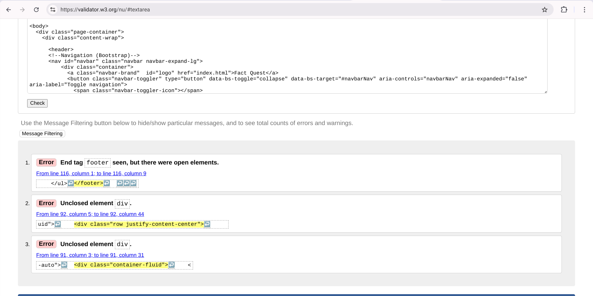
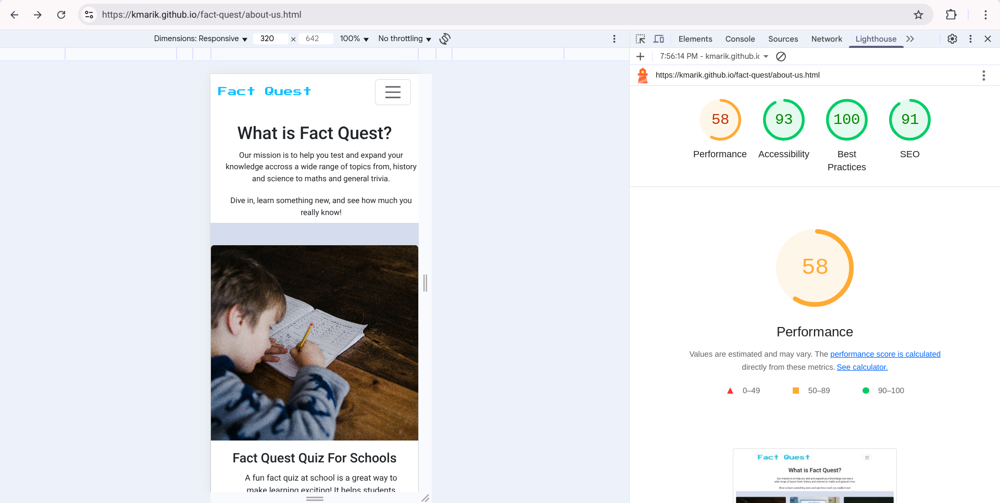
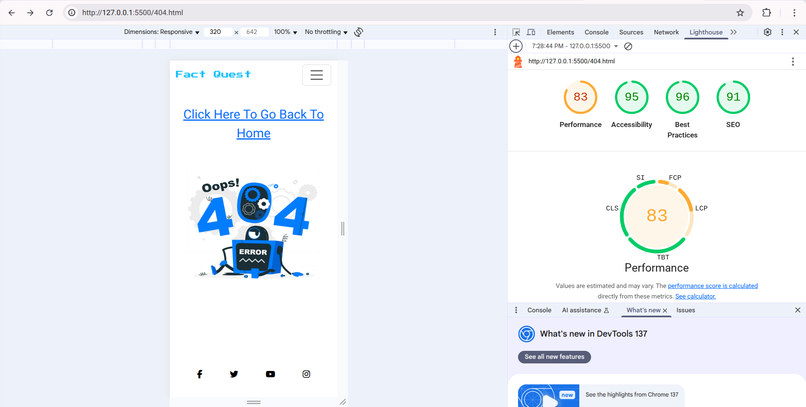

# Fact Quest

(Developer: Mariama Kamara)

[Live webpage](https://kmarik.github.io/fact-quest/index.html)

## Table of Contents
1. [Project Goals](#project-goals) 
- [User Goals](#user-goals)
- [Site Owner Goals](#site-owner-goals) 
2. [User Experience](#user-experience) 
- [Target Audience](#target-audience) 
- [User Requirements and Expectations](#user-requirments-and-expectations)
- [User Stories](#user-stories)
3. [Design](#design)
- [Design Choices](#design-choices)
- [Colours](#colours) 
- [Fonts](#fonts) 
- [Structure](#structure) 
- [Wireframes](#wireframes) 
4. [Technologies Used](#technologies-used) 
- [Languages](#languages)
- [Frameworks and Tools](#frameworks--tools)
5. [Features](#features)
6. [Testing](#testing)
- [HTML Validation](#html-validation)
- [CSS Validation](#css-validation)
- [JS Validation](#javascript-validation)
- [Accessibility](#accessibility)
- [Performance](#performance) 
- [Device Testing](#device-testing) 
- [Browser Compatibility](#browser-compatibility) 
- [Testing User Stories](#testing-user-stories)
7. [Bugs](#bugs)
8. [Deployment](#deployment)
9. [Credits](#credits) 
10. [Acknowledgments](#acknowledgements) 

### Project Goals

#### User Goals
- Learn fun facts and test knowledge. 
- Enjoy playing an easy, quick quiz. 
- See score right after finishing. 
- Use the site/play the quiz on any phone, tablet or computer.

#### Site Owner Goals
- Attract new users and keep them coming back. 
- Share the site with schools, teams and groups. 
- Collect feedback to improve the quiz. 
- Offer a helpful, friendly experience. 
### User Experience

#### Target Audience
- People looking for a quick fun fact quiz game, that can be played in schools, work and for fun.
- For students it's for learning. 
- For workers/teams it's for team bonding or training. 
- For anyone, for fun its to relax or challenge friends.  

#### User Requirments and Expectations
- A simple navigation system which works well on phones, tablets and computers.
- Gives score when the game is done or timer is up.
- Shows current question and time left.
- Option to replay quiz when the game is done or time is up.
- A timer for users who want a challenge. 
- Clear buttons and readable text.
- Easy contact options.
- Accessibility.

#### User Stories:

#### First-time User 
1. I want to know what the quiz is about. 
2. I want to play the game easily.
3. I want a simple way to start playing without signing up. 
4. I want to visit the 'About Us' page to learn more. 
5. I want to view a quiz question with an image and multiple answer options.
6. I want to see a visible countdown timer showing the remaining time to answer.
7. I want to retry the quiz game if I run out of time.
8. I want to see my score and retry if my score is low.
9. I want to contact support if something goes wrong.  

#### Returning User
10. I want to play the quiz again even if it's the same questions. 
11. I want to improve my score and see if I remember the answers. 
12. I want to challenege my work colleague/teams and friends to beat my score  

#### Site Owner
13. I want the quiz questions to stay the same so users can retry them.
14. I want to make sure users have a smooth, fun experience each time they visit.
15. I want to see how people use the site and improve it based on feedback.
16. I want to display links to my social media profiles on the website. So that users can easily find and follow Fact Quest on platforms like Instagram, Twitter, or Facebook to stay updated, share content, and grow the community

### Design
#### Design Choices:
The webpage was designed with a simple, minimalist approach to enhance user experience. It is clear and intuitive, allowing users to easily understand the quiz's purpose and participate without any hassle. 

#### Colours:
For the colour scheme, bright colours were chosen to engage the user. I selected the colors by browsing through various options and choosing the ones that best suited the aesthetic and purpose of my site. I found my desired colours on [Image Color Picker](https://imagecolorpicker.com/) website and searched for there HEX Code. The two colours I chose are #d5dced; used for backround colour and #0dbffe; used for the logo font colour. 

#### Fonts:
The two main fonts are Press Start 2P which is the primary font with a fallback of sans-serif and Roboto which is the secondary font with a fall back of sans-serif.

#### Structure:
The page is structured in a easy, user friendly way. When the user arrives on the website they are immediately welcomed with the logo on the center of the page and above a familiar type of navigation bar to the right. The website consists of four pages:
1. A homepage with a navbar at the top and logo and a button to start the game. 
2. A about us page with a descriptive insight of what the quiz is about, who and where the game can be played. 
3. A quiz game page with a timer at the top that starts as soon as the page loads. The quiz has 10 questions, each with a matching image. Below each question are multiple choice answers, and a "Next" button lets the user move to the next question when a answer is chosen. 
4. A contact us page which consits of a contact form, email address and contact number.

#### Wireframes

Home

About Us

Quiz Game

Contact Us

### Technologies Used
#### Languages 
- HTML
- CSS
- JavaScript

#### Frameworks & Tools
- Bootstrap v5.03
- Git 
- GitHub
- Visual Studio Code
- Balsamiq
- Google Fonts
- Image Color Picker 
- Font Awesome
- Unsplash
- Freepik
- Favicon.io
- Email API 

### Features
The page consists of four pages and eleven features. 

1. Logo and Navigation Bar

- Featured on all four pages 
- The navbar is responsive and changes to a menu icon on smaller screens (320px and up, 576px and up to 992px). It includes link to the Home page, about us page, quiz game page and contact us page
- It allows users to easily navigate the page 
- User stories covered : 4, 14 

2. Start Game Button 

- Featured on the home page and allows the user to start the game quicker than clicking 'Quiz Game' in the navbar. 
- User stories covered: 2, 3, 10, 14

3. About Us 

- Provides users with a clear understanding of what Fact Quest offers and who the intended audience are.
- User stories covered: 1, 4, 

4. Quiz Game (timer)

- Provides the user with a countdown when the game begins. 
- User stories covered: 6

5. Quiz Game (question and multiple choice answers)

- The game has ten different questions with four multiple choice answers. 
- User stories covered:5, 10, 11, 12, 13

6. Quiz Game (restart button)

- When the timer is up or the quiz game is done the player can restart the quiz by clicking the 'Restart' button. 
- User stories covered:7, 8, 10, 11, 12, 13

7. Quiz Game (game over page)

- This is a separate page that appears only when the quiz is incomplete and the timer runs out, displaying the user's score up to that point.
- User stories covered:7, 8, 11, 13

8. Quiz Game (score page)

- This is a dedicated results page that appears only after the quiz is completed. It displays the player's score and indicates whether they have passed or not. The thumbs up image (green) indicates the player has passed and the thumbs down image (red) indicates the player has not pass the quiz.
- User stories covered:8, 11

9. Contact Form

- A way for the user to send written enquiries about the game or website. 
- User stories covered: 9, 15

10. Contact Info

- Provides the user with a contact email and phone number. 
- User stories covered: 9, 15

11. Footer 

- Featured on all four pages
- Consits of four social media links (Facebook, Twitter, Youtube and Instagram)
 - User stories covered: 16 

### Testing

#### Manual Testing v Automated Testing 
- For manual testing I went through my website the same way a normal user would. I checked that all the links worked, the buttons responded properly, and the forms accepted valid input but rejected incorrect ones. I also opened the site on both desktop and mobile screens to make sure the layout stayed responsive and didn’t break when resized.

- For automated testing I used Lighthouse in Chrome DevTools. This gave me an automated report on performance, accessibility, SEO, and best practices. It helped me spot a couple of areas where I could improve my site, like image optimization and making sure contrast ratios were good for readability.

 Overall, I combined manual testing (to check user interactions and responsiveness by hand) with a bit of automated testing (using Lighthouse to get objective performance and accessibility scores). This way I was able to confirm that the site works correctly for users and also meets modern web standards.

#### HTML Validation
- The W3S Markup Validation Service was used to validate the HTML of the website showing the validation before and after once it has been fixed.

Home page
Fixed:

About us page
Fixed:

Quiz game page
Fixed:

Contact page
Fixed:

404 page
Fixed:

#### CSS Validation
- The W3C CSS Validator was used to validate the the CSS of the website.

CSS
Fixed:

#### JavaScript Validation
- The JSlint validator was used to validate the Javascript of the website.

Javascript

 

#### Accessibility
- The WAVE WebAIM web accessibility evaluation tool was used to ensure the website fulfillled high accessibility. Across all pages it passed with 0 errors. 

Home page

About us page

Quiz game page

Contact us page

#### Performance 
- Google Lighthouse in Google Chrome Developer Tools was used to test the performance of the website. 

Home page

About us page

Quiz game page

Contact us page

404 page

### Device testing
#### Device compatibility
The website was tested on the following devices:
- Chromebook Plus 14a
- Iphone 12pro Max 
- Iphone 14
- Iphone 15
#### Browser compatibility
The website was tested on the following browsers:
- Google Chrome
- Microsoft Edge 

#### Testing user stories
1.  I want to know what the quiz is about.

| **Feature** | **Action** | **Expected Result** | **Actual Result** |
|-------------|------------|---------------------|-------------------|
| Navbar | Navigate to the About Us page | Welcomed with 'What is Fact Quest?' question with text below| Works as expected |
 
2. I want to play the game easily.

| **Feature** | **Action** | **Expected Result** | **Actual Result** |
|-------------|------------|---------------------|-------------------|
| Button | On the home page there is a 'CLICK HERE TO START QUIZ!' button | Starts the quiz| Works as expected |

3.  I want a simple way to start playing without signing up.

| **Feature** | **Action** | **Expected Result** | **Actual Result** |
|-------------|------------|---------------------|-------------------|
| Button | On the home page there is a 'CLICK HERE TO START QUIZ!' button | Starts the quiz| Works as expected |

4. I want to visit the 'About Us' page to learn more. 

| **Feature** | **Action** | **Expected Result** | **Actual Result** |
|-------------|------------|---------------------|-------------------|
| Navbar | Navigate to the About Us page | Welcomed with 'What is Fact Quest?' question with text below| Works as expected |

5. I want to view a quiz question with an image and multiple answer options. 

| **Feature** | **Action** | **Expected Result** | **Actual Result** |
|-------------|------------|---------------------|-------------------|
| Navbar | Navigate to the Quiz Game page| Welcomed with a timer, quiz question, quiz image and multiple choice answers| Works as expected |

6. I want to view a quiz question with an image and multiple answer options. 

| **Feature** | **Action** | **Expected Result** | **Actual Result** |
|-------------|------------|---------------------|-------------------|
| Navbar | Navigate to the Quiz Game page| Welcomed with a timer, quiz question, quiz image and multiple choice answers| Works as expected |

7. I want to retry the quiz game if I run out of time.

| **Feature** | **Action** | **Expected Result** | **Actual Result** |
|-------------|------------|---------------------|-------------------|
| Restart button | When the timer is up a restart button will be below| Once the button is clicked it will restart the quiz| Works as expected |
 
8. I want to see my score and retry if my score is low.

| **Feature** | **Action** | **Expected Result** | **Actual Result** |
|-------------|------------|---------------------|-------------------|
| Score page | Finish the quiz | 'Restart' button appears below | Works as expected |

9. I want to contact support if something goes wrong. 

| **Feature** | **Action** | **Expected Result** | **Actual Result** |
|-------------|------------|---------------------|-------------------|
| Contact form | Navigate to the Contact Us page| A form that can be filled out to send enquiries and contact email and number below the form| Works as expected | 

10. I want to play the quiz again even if it's the same questions. 

| **Feature** | **Action** | **Expected Result** | **Actual Result** |
|-------------|------------|---------------------|-------------------|
| Restart button | Select the 'Restart' button at the end of the quiz| Quiz restarts from question 1 with all scores and selections reset| Works as expected |

11. I want to improve my score and see if I remember the answers.  

| **Feature** | **Action** | **Expected Result** | **Actual Result** |
|-------------|------------|---------------------|-------------------|
| Restart button| At the end of the quiz select the 'Restart' button | Quiz restarts, allowing user to retake it and try for a higher score | Works as expected |

12.  I want to challenege my work colleague/teams and friends to beat my score  

| **Feature** | **Action** | **Expected Result** | **Actual Result** |
|-------------|------------|---------------------|-------------------|
| 'CLICK HERE TO START QUIZ' button | User completes quiz |Final score is displayed | Works as expected |

13. I want the quiz questions to stay the same so users can retry them.

| **Feature** | **Action** | **Expected Result** | **Actual Result** |
|-------------|------------|---------------------|-------------------|
| Static questions | Click 'Restart' button | The same set of questions is shown every time the game is played | Works as expected |

14.  I want to make sure users have a smooth, fun experience each time they visit.

| **Feature** | **Action** | **Expected Result** | **Actual Result** |
|-------------|------------|---------------------|-------------------|
| Responsive layout| User access the website on different screen sizes | Quiz adjusts properly on mobile, tablet, and desktop | Works as expected |

15.  I want to see how people use the site and improve it based on feedback.

| **Feature** | **Action** | **Expected Result** | **Actual Result** |
|-------------|------------|---------------------|-------------------|
| Form | Navigate to the 'Contact Us' page | A simple form or prompt allows user to leave comments or suggestions| Works as expected |

16. I want to display links to my social media profiles on the website. So that users can easily find and follow Fact Quest on platforms like Instagram, Twitter, or Facebook to stay updated, share content, and grow the community

| **Feature** | **Action** | **Expected Result** | **Actual Result** |
|-------------|------------|---------------------|-------------------|
| Social media icons in the footer | User clicks on a social media icon |The corresponding social media page opens in a new browser tab | Works as expected |

### Bugs

| **Bug** | **Fix** |
| ----------- | ----------- |
| The menu not opening on smaller screen sizes (320px, 576px and 768px) | Copied the JS scripted tag from Bootstrap and attached it to all pages.  |
| Image on quiz game was not loading | Added 'image-wrapper' div id to html with the image src inside and on JS added 'const wrapEl = document.getElementById("image-wrapper");; to the loadQuestion fuction.
| Home page content was not centering to the middle of the page | The custom CSS code I had for the home page styling was conflicting with Bootstraps styles. So I had to remove it and replaced it with Bootstrap utility classes instead.
| 404 page footer was not staying at the bottom of the screen| I had a missing 
 for .content-wraper .

### Deployment
 The website was deployed using GitHub Pages by following these steps:

 1. In the GitHub repository select the 'Settings' tab
 2. On the left side select 'Pages'
 3. Under 'Build and deployment (source)' select the drop down box then select 'Deploy from a branch'
 3. Under 'Branch' select 'main' beside 'main' you will see a folder icon select it and then select '/root'
 4. After the webpage automatically refreshes, you'll see at the top 'Your site is life at https://kmarik.github.io/fact-quest/

 You can for fork the repository by following these steps:
1. Go to the GitHub repository
2. Click on Fork button in upper right hand corner

You can clone the repository by following these steps:
1. Go to the GitHub repository 
2. Locate the Code button above the list of files and click it 
3. Select if you prefere to clone using HTTPS, SSH, or Github CLI and click the copy button to copy the URL to your clipboard
4. Open Git Bash
5. Change the current working directory to the one where you want the cloned directory
6. Type git clone and paste the URL from the clipboard ($ git clone https://github.com/YOUR-USERNAME/YOUR-REPOSITORY)
7.Press Enter to create your local clone.

 You can clone the repository via Github desktop by following these steps: 

1. Go to the Github repository
Select the '<> Code' drop down button then copy the URL
2. Select 'File' on the desktop then select 'Clone repository'
3. Click 'URL' and paste the URL
4. Then select 'Clone'

### Credits 
#### Media 
In order of appearance:
1. About us images: 
 -  Image 1 by: Annie Spratt [Unsplash](https://unsplash.com/photos/boy-writing-ORDz1m1-q0I)
- Image 2 by: Walls.io [Unsplash](https://unsplash.com/photos/a-group-of-women-sitting-around-a-conference-table-eiUFKyL9zeM)
- Image 3 by: 8 verthing [Unsplash](https://unsplash.com/photos/red-and-white-game-on-led-signage-k_pBB5wJtaU)

2. Quiz game question images in order: 
- Question 1 image by: Anthony Choren [Unsplash](https://unsplash.com/photos/yugoslavia-flag-under-blue-sky-lYzap0eubDY)
 - Question 2 image by: Bolivianteligen [Unsplash](https://unsplash.com/photos/a-group-of-planets-in-the-dark-sky-_75VdeLT3BI)
 -  Question 4 image by: Kyle Head [Unsplash](https://unsplash.com/photos/silhouette-of-three-performers-on-stage-p6rNTdAPbuk)
 -  Question 4 image by: Hans Reiners [Unsplash](https://unsplash.com/photos/three-clear-beakers-placed-on-tabletop-lQGJCMY5qcM)
 - Question 6 image by: Ivan Torres [Unsplash](https://unsplash.com/photos/pizza-with-berries-MQUqbmszGGM)
 - Question 6 image by: Dan Cristian Pa Dure [Unsplash](https://unsplash.com/photos/a-blackboard-with-a-bunch-of-diagrams-on-it-h3kuhYUCE9A)
 - Question 7 image by: Nasa [Unsplash](https://unsplash.com/photos/earth-with-clouds-above-the-african-continent-vhSz50AaFAs)
 - Question 8 image by: Eutah Mizushima [Unsplash](https://unsplash.com/photos/river-between-trees-under-blue-sky-OWwK_0_EnxY)
 - Question 9 image by: Jack Ansety Ht [Unsplash](https://unsplash.com/photos/lake-between-trees-and-mountains-HtUBBdNDxpQ)
- Question 10 image by: Vimal S [Unsplash](https://unsplash.com/photos/shape-KMOSPP_iYV8)

3. Quiz game - game over image: [Freepik](https://www.freepik.com/free-photo/stressed-young-student-girl-wearing-bandana-backpack-showing-alarm-clock-making-stop-gesture-screaming-with-closed-eyes-isolated-blue-background_27467065.htm#fromView=search&page=1&position=46&uuid=3af0632b-ad45-478d-bd4b-314dfe6eca04&query=times+up)

4. Quiz game - score image (cropped and split into two): by juicy_fish [Freepik](https://www.freepik.com/free-vector/circle-thumbs-up-set_81409606.htm#fromView=image_search&page=1&position=4&uuid=c4190681-be96-4e3d-b359-3921a40c8693)

3. 404 image: [Freepik](https://www.freepik.com/free-vector/oops-404-error-with-broken-robot-concept-illustration_8030430.htm#fromView=image_search&page=1&position=1&uuid=1854bd59-2290-44aa-9e76-9765b4e7ee60&query=404+error)

#### Code
In order of appearance 
- The HTML for the responsive [Navbar with toggler](https://getbootstrap.com/docs/5.2/components/navbar/) was taken from the Bootstrap v5.3 documentation. 
- The ['CLICK HERE TO START QUIZ!' button](https://getbootstrap.com/docs/5.3/components/buttons/#base-class) on the home page was taken from Bootstrap v5.3 documentation. 
- The About Us [cards](https://getbootstrap.com/docs/5.3/components/card/#about) on the About Us page was taken from Bootstrap v5.3 documentation.
- The [Contact Form](https://getbootstrap.com/docs/5.3/forms/overview/#overview) on the Contact Us page was taken from Bootstrap v5.3 documentation. 

- The CSS code for the contact form on the contact us page was taken from [ChatGPT](https://chatgpt.com/).

### Acknowledgements
I would like to take the opportunity to thank: 

- My tutor Ashley Oliver, for his unwavering support and for providing clarity whenever I struggled to understand.
- My mentor Mo Shami, for his support and guidance during the project insuring I meet the deadline successfully. 
- My newfound virtual friends on the Code Insitute Slack for their support and help. 

