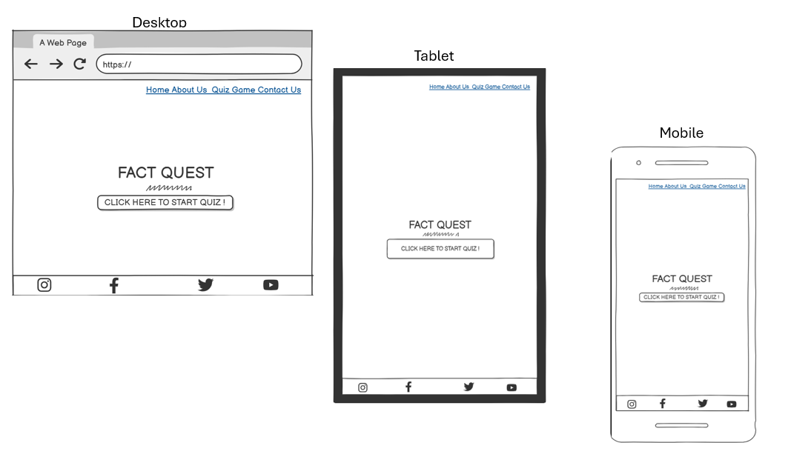
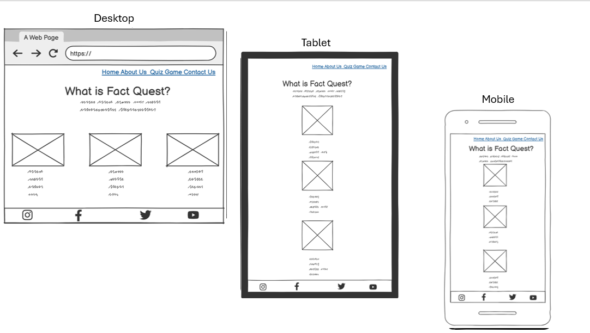
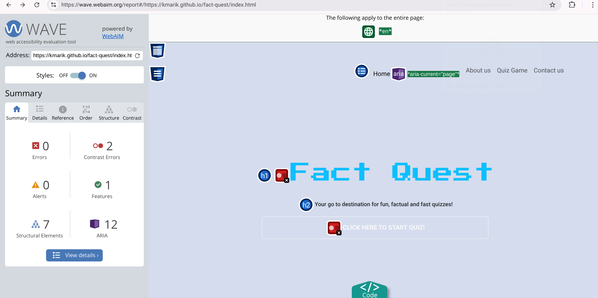
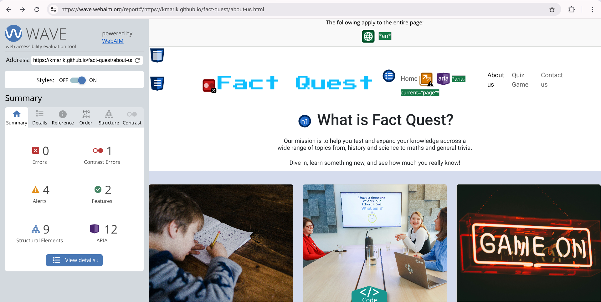
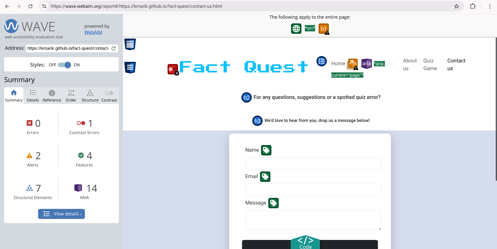
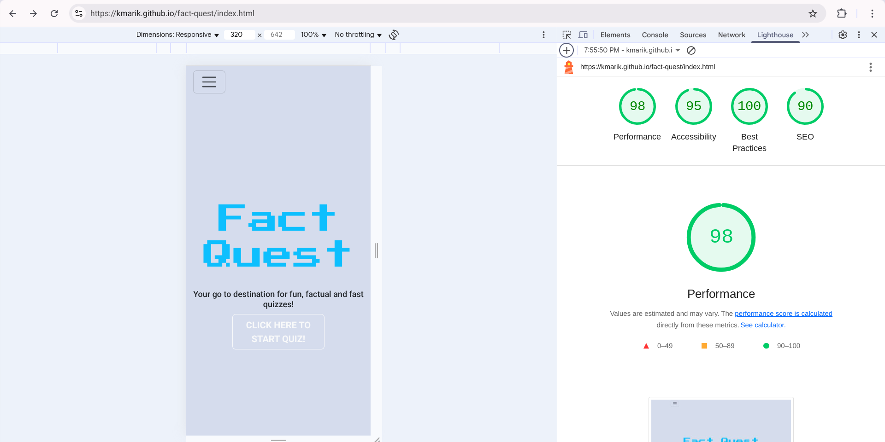
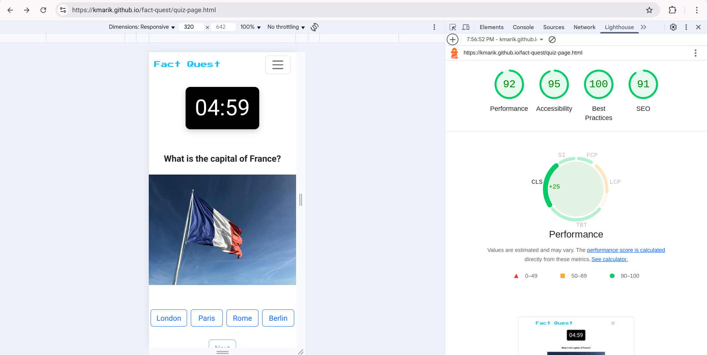
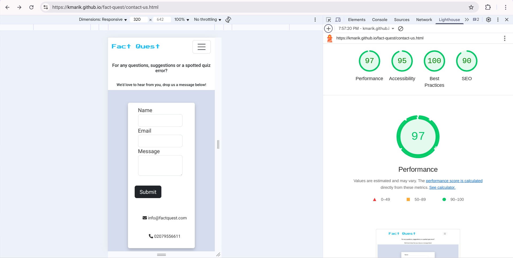

# Fact Quest

(Developer: Mariama Kamara)

[Live webpage](https://kmarik.github.io/fact-quest/index.html)

## Table of Contents
1. [Project Goals](#project-goals) 
- [User Goals](#user-goals)
- [Site Owner Goals](#site-owner-goals) 
2. [User Experience](#user-experience) 
- [Target Audience](#target-audience) 
- [User Requirements and Expectations](#user-requirments-and-expectations)
- [User Stories](#user-stories)
3. [Design](#design)
- [Design Choices](#design-choices)
- [Colours](#colours) 
- [Fonts](#fonts) 
- [Structure](#structure) 
- [Wireframes](#wireframes) 
4. [Technologies Used](#technologies-used) 
- [Languages](#languages)
- [Frameworks and Tools](#frameworks--tools)
5. [Features](#features)
6. [Testing](#testing)
- [HTML Validation](#html-validation)
- [CSS Validation](#css-validation)
- [Accessibility](#accessibility)
- [Performance](#performance) 
- [Device Testing](#device-testing) 
- [Browser Compatibility](#browser-compatibility) 
- [Testing User Stories](#testing-user-stories)
7. [Bugs](#bugs)
8. [Deployment](#deployment)
9. [Credits](#credits) 
10. [Acknowledgments](#acknowledgements) 

### Project Goals

#### User Goals
- Learn fun facts and test knowledge. 
- Enjoy playing an easy, quick quiz. 
- See score right after finishing. 
- Use the site/play the quiz on any phone, tablet or computer

#### Site Owner Goals
- Attract new users and keep them coming back. 
- Share the site with schools, teams and groups. 
- Collect feedback to improve the quiz. 
- Offer a helpful, friendly experience. 
### User Experience

#### Target Audience
- People looking for a quick fun fact quiz game, that can be played in schools, work and for fun.
- For students it's for learning. 
- For workers/teams it's for team bonding or training. 
- For anyone for fun its to relax or challenge friends.  

#### User Requirments and Expectations
- A simple navigation system which works well on phones, tablets and computers
- Gives score when the game is done or timer is up
- Shows current question and time left
- Option to replay quiz when the game is done or time is up
- A timer for users who want a challenge 
- Clear buttons and readable text
- Easy contact options
- Accessibility

#### User Stories:

#### First-time User 
1. As a first time user, I want to know what the quiz is about. 
2. As a first time user, I want to play the game easily.
3. I want a simple way to start playing without signing up. 
4. I want to visit the 'About Us' page to learn more. 
5. I want to contact support if something goes wrong.  

#### Returning User
6. I want to play the quiz again even if it's the same questions. 
7. I want to improve my score and see if I remember the answers. 
8. I want to challenege my work colleague/teams and friends to beat my score  

#### Site Owner
9. I want the quiz questions to stay the same so users can retry them.
10. I want to make sure users have a smooth, fun experience each time they visit.
11. I want to see how people use the site and improve it based on feedback.

### Design
#### Design Choices:
The webpage was designed with a simple, minimalist approach to enhance user experience. It is clear and intuitive, allowing users to easily understand the quiz's purpose and participate without any hassle. 

#### Colours:
For the colour scheme bright colours were chosen to engage the user. I selected the colors by browsing through various options and choosing the ones that best suited the aesthetic and purpose of my site. [Image Color Picker](https://imagecolorpicker.com/) website and searched for there HEX Code. The two colours I chose are #d5dced; used for backround colour and #0dbffe; used as a font colour. 

#### Fonts:
The two main fonts are Press Start 2P which is the primary font with a fallback of sans-serif and Roboto which is the secondary font with a fall back of sans-serif.

#### Structure:
The page is structured in a easy, user friendly way. When the user arrive on the website they are immediately welcomed with a logo on the center of the page below a familiar type of navigation bar to the right. The website consists of four pages:
1. A homepage with a navbar at the top and logo and a button to start the game. 
2. A about us page with a descriptive insight of what the quiz is about, who and where the game can be played. 
3. A quiz game page with a timer at the top that starts as soon as the page loads. The quiz has 10 questions, each with a matching image. Below each question are multiple choice answers. A "Next" button lets the user move to the next question.
4. A contact page a contact form, a address and contact number, (ADD TO PAGE)

#### Wireframes

Home

About Us

Quiz Game

Contact Us

### Technologies Used
#### Languages 
- HTML
- CSS
- JavaScript

#### Frameworks & Tools
- Bootstrap v5.03
- Git 
- GitHub
- Gidpod
- Balsamiq
- Google Fonts
- Image Color Picker 
- Font Awesome
- Pexels
- Unsplash
- Favicon.io
- Jquery?

### Features
The page consists of four pages and ten features. 

1. Logo and Navigation Bar

- Featured on all four pages 
- The navbar is responsive and changes to a toggler on smaller screens (320px and up, 576px and up to 992px). It includes link to the Homepage, About us page, Projects page and Contact us page
- It allows users to easily navigate the page 
 
 2. Carousel
 

 - Presents to the user the companys expertise showcasing its previous interior design work
 - Gives options for the user to navigate the slideshow back and fourth via the arrows
 - User stories covered: 3

3. Subscription form

- Allows customers to sign up to the newsletter to for latest updates and deals
- User stories covered: 7, 8 and 13

 
4. Footer

 - Featured on all four pages 
 - Consits of four social media links (Facebook, Twitter, Youtube and Instagram)
 - User stories covered: 6,7,8 and 9

5. About us

 
 - Gives a detail description of what 'Luxury Loom Interiors' company has to offer 
 - Includes two images of the founder and co founder of the company
 - User stories covered: 2, 3, 14 

6. Projects

- Presents to the user the project outcomes that the company have done for its clients within the United Kingdom with a small description of the location of each project
- User stories covered: 3 and 6  

7. Contact Form

- A way for the user to send written enquiries to the company
- User stories covered: 4 and 15

8. Map

- Shows the precise location of the showcase studio
- User stories covered: 11 and 15

9. Info section

- Provides the user with a phone number, email and address
- User stories covered: 1, 4, 9, 15

10. 404 page

- Provides a clear and visible message that the page is not found
- User stories covered: 12

### Testing
#### HTML Validation
- The W3S Markup Validation Service was used to validate the HTML of the website showing the validation before and after once it has been fixed.

Home page
Fixed:

About us page
Fixed:

Quiz game page
Fixed:

Contact page
Fixed:

404 page
Fixed:

#### CSS Validation
- The W3C CSS Validator was used to validate the the CSS of the website.

CSS

#### JavaScript Validation
- The JS Hint validator was used to validate the Javascript of the website.

Javascript

 

#### Accessibility
- The WAVE WebAIM web accessibility evaluation tool was used to ensure the website fulfillled high accessibility. Across all pages it passed with 0 errors. 

Home page

About us page

Quiz game page

Contact us page

#### Performance 
- Google Lighthouse in Google Chrome Developer Tools was used to test the performance of the website. 

Home page

About us page

Quiz game page

Contact us page

404 page

### Device testing
#### Device compatibility
The website was tested on the following devices:
- Chromebook Plus 14a
- Iphone 12pro Max 
- Iphone 15
#### Browser compatibility
The website was tested on the following browsers:
- Google Chrome
- Microsoft Edge 

#### Testing user stories
1. As a first time user, I want to know where the business is located i.e country & city.

| **Feature** | **Action** | **Expected Result** | **Actual Result** |
|-------------|------------|---------------------|-------------------|
| Map | Navigate to the Contact Us page, locate the Google Map | Locating a map showing the location of the show room studio| Works as expected |

2. As a first time user, I want to know what services the business has to offer.

| **Feature** | **Action** | **Expected Result** | **Actual Result** |
|-------------|------------|---------------------|-------------------|
| About us page |  Navigate to the About us page | Paragraphs on what the business is about and what it has to offer | Works as expected |

3. As a first time user, I want to get a feel of how the business will elevate my space.

| **Feature** | **Action** | **Expected Result** | **Actual Result** |
|-------------|------------|---------------------|-------------------|
| About us page | Nagivate to the About us page | Written information on how the company will elevate a potential clients space | Works as expected |
| Projects page |  Navigate to the Projects page | See images of projects the business has done for its clients| Works as expected |

4. As a first time user, I want to know how best to contact the company.

| **Feature** | **Action** | **Expected Result** | **Actual Result** |
|-------------|------------|---------------------|-------------------|
| Contact info |  Navigate to the Contact us page | Scroll down to the contact info section to see the phone number, email and address| Works as expected |

5. As a first time user, I want a clear explanation that the page I'm looking for cannot be found

| **Feature** | **Action** | **Expected Result** | **Actual Result** |
|-------------|------------|---------------------|-------------------|
| 404 error page|  Break the website link | A 404 error image and link to the website will be shown | Works as expected |

6. As a returning user, I want to see the companys latest project.

| **Feature** | **Action** | **Expected Result** | **Actual Result** |
|-------------|------------|---------------------|-------------------|
| Projects page |  Navigate to the Projects page | See images of projects the business has done for its clients| Works as expected |

7. As a returning user, I want to know if there is a new service.

| **Feature** | **Action** | **Expected Result** | **Actual Result** |
|-------------|------------|---------------------|-------------------|
| Home page |  Navigate to the Home page then scroll down to the subcription form then subscribe | Once subscribed the customer will be updated if there is a new service | Works as expected |
 
8. As a returning user, I want to know if there is any new offers.

| **Feature** | **Action** | **Expected Result** | **Actual Result** |
|-------------|------------|---------------------|-------------------|
| Home page |  Navigate to the Home page then scroll down to the subcription form then subscribe | Once subscribed the customer will be updated if there is new offers | Works as expected |

9. As a returning user, I want to know if the contact details are the same or have changed. 

| **Feature** | **Action** | **Expected Result** | **Actual Result** |
|-------------|------------|---------------------|-------------------|
| Home page |  Navigate to the Home page then scroll down to the subcription form then subscribe | Once subscribed the customer will be updated if the contact details have changed | Works as expected |

10. As a returning user, I want to know who founded the company.

| **Feature** | **Action** | **Expected Result** | **Actual Result** |
|-------------|------------|---------------------|-------------------|
| About us page |  Navigate to the About us page and scroll down | Written information on who founded the company and images of the founder & co founder | Works as expected |

11. As a returning user, I want to get directions to the companys showroom studio. 

| **Feature** | **Action** | **Expected Result** | **Actual Result** |
|-------------|------------|---------------------|-------------------|
| Map | Navigate to the Contact Us page, locate the Google Map | Locating a map showing the location of the show room studio| Works as expected |

12. As a returning user, I want the 404 page to include a quick way to navigate to the pages on the website.

| **Feature** | **Action** | **Expected Result** | **Actual Result** |
|-------------|------------|---------------------|-------------------|
| Link | Click the link highlighted in blue | Direct back to the website | Works as expected |

13. As the site owner, I want users to find news about offers, latest trends and expert tips.

| **Feature** | **Action** | **Expected Result** | **Actual Result** |
|-------------|------------|---------------------|-------------------|
| Home page |  Navigate to the Home page then scroll down to the subscription form then subscribe | Once subscribed the customer will be updated on offers, latest trends and expert tips | Works as expected |

14. As the site owner, I want users to get to know the business and how it evolved. 

| **Feature** | **Action** | **Expected Result** | **Actual Result** |
|-------------|------------|---------------------|-------------------|
| About us page | Nagivate to the About us page | Written information on the company and how it evolved | Works as expected |

15. As the site owner, I want users to be able to contact us via a form, email, telephone or our showcase studio location.

| **Feature** | **Action** | **Expected Result** | **Actual Result** |
|-------------|------------|---------------------|-------------------|
| Contact form | Nagivate to the Contact us page | Contact form requesting name, email and message| Works as expected |
| Contact info |  Navigate to the Contact us page | Scroll down to the contact info section to see the phone number and address| Works as expected |
| Map | Navigate to the Contact us page, locate the Google Map | Locating a map showing the location of the show room studio| Works as expected |

### Bugs

| **Bug** | **Fix** |
| ----------- | ----------- |
| Home page link stays highlighted when visiting another page | Change active atribute to the correct page |
| The contact info section on Iphone screen size 468px was beside the map but I wanted it above the map | Reduced the size of the map (iframe) to width and height of 300px which automatically rearranged the map to be below the contact info section |
| Footer on screen size 320 px and 576 px  was showing white space after the footer| Set footer colour to secondary colour |

### Deployment
 The website was deployed using GitHub Pages by following these steps:

 1. In the GitHub repository select the 'Settings' tab
 2. On the left side select 'Pages'
 3. Under 'Build and deployment (source)' select the drop down box then select 'Deploy from a branch'
 3. Under 'Branch' select 'main' beside 'main' you will see a folder icon select it and then select '/root'
 4. After the webpage automatically refreshes, you'll see at the top 'Your site is life at https://kmarik.github.io/luxury-loom-interiors/

 You can for fork the repository by following these steps:
1. Go to the GitHub repository
2. Click on Fork button in upper right hand corner

You can clone the repository by following these steps:
1. Go to the GitHub repository 
2. Locate the Code button above the list of files and click it 
3. Select if you prefere to clone using HTTPS, SSH, or Github CLI and click the copy button to copy the URL to your clipboard
4. Open Git Bash
5. Change the current working directory to the one where you want the cloned directory
6. Type git clone and paste the URL from the clipboard ($ git clone https://github.com/YOUR-USERNAME/YOUR-REPOSITORY)
7.Press Enter to create your local clone.

 You can clone the repository via Github desktop by following these steps: 

1. Go to the Github repository
Select the '<> Code' drop down button then copy the URL
2. Select 'File' on the desktop then select 'Clone repository'
3. Click 'URL' and paste the URL
4. Then select 'Clone'

### Credits 
#### Media 
In order of appearance:
- Carousel images 1, 2 and 4: Photo by Spacejoy on [Unsplash](https://unsplash.com/@spacejoy)
- Carousel image 3: by Medhat Ayad on [Pexels](https://www.pexels.com/photo/3d-model-3ds-max-arcviz-bath-towels-543798/)
- Founder image: by Emmy E [Pexels](https://www.pexels.com/photo/woman-wearing-gray-notch-lapel-suit-jacket-2381069/)
- Co founder image: by Alina Matveycheva [Pexels](https://www.pexels.com/photo/woman-standing-in-white-suit-jacket-25985701/)
- Project images: by Spacejoy on [Unsplash](https://unsplash.com/@spacejoy) 
- Contact us image: by Wilcle Nunes on [Pexels](https://www.pexels.com/photo/decor-in-luxurious-apartment-27059631/)
- 404 error image: on Freepik [Freepik](https://www.freepik.com/free-vector/error-404-concept-landing-page_8794579.htm#fromView=keyword&page=1&position=38&uuid=2e18e1a6-3a97-492a-8ee2-60789fc2387d)

#### Code
In order of appearance 
- The HTML for the responsive [Navbar with toggler](https://getbootstrap.com/docs/5.2/components/navbar/) was taken from the Bootstrap v5.3 documentation. 
- [The carousel](https://getbootstrap.com/docs/5.3/components/carousel/#how-it-works) on the home page was taken from Bootstrap v5.3 documentation. 
- The [subsciption form](https://getbootstrap.com/docs/5.3/forms/overview/#overview) on the home page was taken from Bootstrap v5.3 documentation. 
- The [alignment of the images](https://getbootstrap.com/docs/4.0/content/images/) on the about us page was taken from Bootstrap v5.3 documentation. 
- The [alignment of the images](https://getbootstrap.com/docs/4.0/content/images/) on the projects page was taken from Bootstrap v5.3 documentation. 
- The [opening times table](https://getbootstrap.com/docs/5.3/content/tables/#overview) on the contact us page was taken from Bootstrap v5.3
- The CSS code for the contact form on the contact page was taken from [W3 Schools](https://www.w3schools.com/css/css_inline-block.asp).
- The CSS code for the contact info media query for screen sizes 768px and 992px was taken from [Stack overflow](https://stackoverflow.com/questions/48516538/flex-align-items-center-not-centering-items).

### Acknowledgements
I would like to take the opportunity to thank: 

- My mentor Mo Shami, for his support and guidance during the project insuring I meet the deadline successfully. 
- My newfound virtual friends on the Code Insitute Slack for their support and help. 

